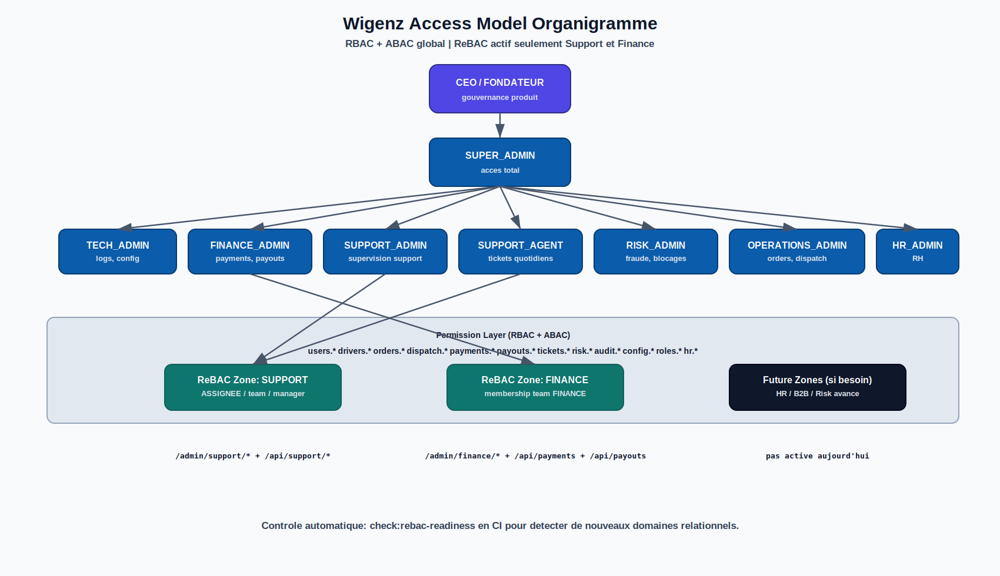
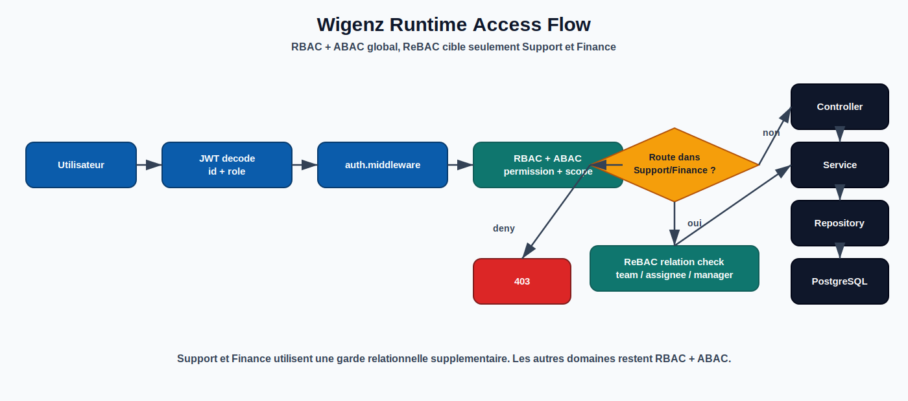

# Integration Organigramme -> RBAC (Vue Image)

## Exports SVG

## Modele d'acces runtime (etat actuel)

- Base globale: `RBAC + ABAC`
- ReBAC actif uniquement sur:
  - `Support`
  - `Finance`
- ReBAC readiness check CI:
  - `npm run check:rebac-readiness`

## Roles techniques retenus (8)

- `SUPER_ADMIN`
- `TECH_ADMIN`
- `FINANCE_ADMIN`
- `SUPPORT_AGENT`
- `SUPPORT_ADMIN`
- `RISK_ADMIN`
- `OPERATIONS_ADMIN`
- `HR_ADMIN`

## Scopes standards

- `own`
- `team`
- `region`
- `global`

## Domains de permissions

- `users.*`
- `drivers.*`
- `orders.*`
- `dispatch.*`
- `payments.*`
- `payouts.*`
- `refund_requests.*`
- `tickets.*`
- `risk.*`
- `documents.*`
- `pricing.*`
- `notifications.*`
- `audit.*`
- `logs.*`
- `config.*`
- `roles.*`
- `hr.*`

## Regles de conception

- Un poste organigramme n'est pas toujours un role technique.
- Le poste "Head of partnerships (B2B)" peut rester un titre organisationnel tant qu'il n'y a pas de module B2B dedie.
- Le controle fin se fait par `permission + scope`, pas seulement par le role JWT.
- ReBAC ne s'active pas globalement: il est deploye domaine par domaine selon le besoin relationnel.
